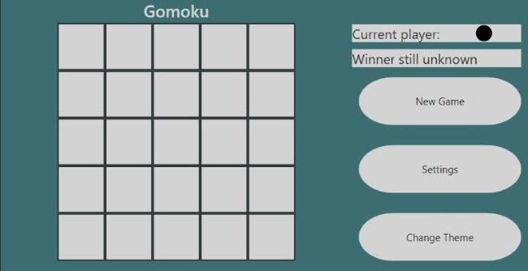
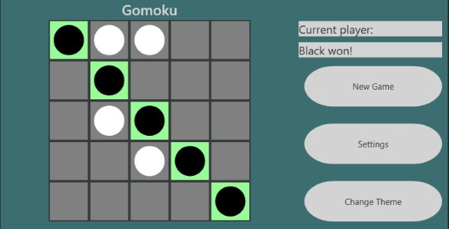
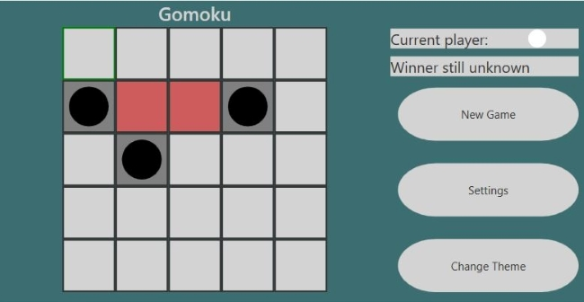
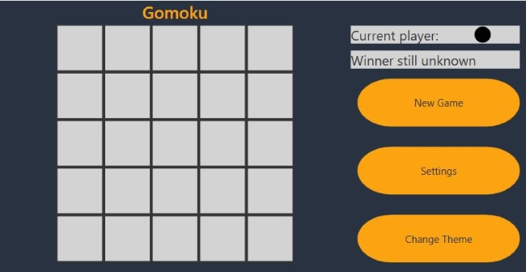

# Gomoku
## Rules
In short, Gomoku is basically Five in a Row:
* It is played on a grid-shaped board, typically 15×15 large.
* There are two players, called black and white.
* Black and white alternatively take turns placing a stone anywhere on the board. Note that contrary to Four in a Row, stones don’t "drop" to the bottom.
* Black goes first.
* The first player to make a sequence of five in a row, wins.
* The game ends in a tie if the current player has no moves left.

An optional rule introduced capturing:
* When a player can surround two of his opponent’s stone (e.g., BWWB of WBBW), the enclosed stones are removed from the board (e.g., BWWB becomes B..B).
* On the next turn, it is forbidden to place a stone where stones were previously captured.

## Screenshots

